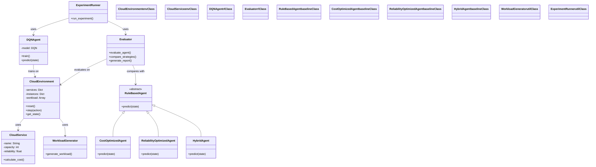

# Cloud RL Cost Optimization - Simplified Class Diagram Specification

## Project Overview
This document provides a simplified specification for creating a class diagram for the Cloud RL Cost Optimization project. The project implements a reinforcement learning framework for optimizing cloud computing costs by intelligently selecting the most cost-effective cloud service types based on dynamic workload characteristics and pricing models.

## Simplified Architecture (8 Core Classes)

### 🔵 Environment Layer
- **CloudEnvironment**: Main simulation environment
- **CloudService**: Individual cloud service model

### 🟢 Reinforcement Learning Layer  
- **DQNAgent**: Deep Q-Network reinforcement learning
- **Evaluator**: Performance evaluation and comparison

### 🟠 Baseline Strategies Layer
- **RuleBasedAgent**: Abstract base class for rule-based strategies
- **CostOptimizedAgent**: Always chooses cheapest service
- **ReliabilityOptimizedAgent**: Prioritizes most reliable service
- **HybridAgent**: Adaptive strategy based on conditions

### 🟣 Utility Layer
- **WorkloadGenerator**: Creates synthetic workload patterns
- **ExperimentRunner**: Orchestrates complete experiments

## Key Relationships

1. **Environment uses CloudServices** (Composition)
2. **DQN trains on Environment** (Usage)
3. **Evaluator compares RL vs Rule-based** (Usage)
4. **Rule-based agents inherit from base class** (Inheritance)
5. **ExperimentRunner coordinates everything** (Orchestration)

## Simplified Mermaid Class Diagram

## Benefits of Simplified Version

✅ **Easy to understand** - Only essential components  
✅ **Clear relationships** - Shows how components interact  
✅ **Color-coded layers** - Visual separation of concerns  
✅ **Perfect for presentations** - Not overwhelming  
✅ **Focuses on architecture** - Core design patterns  

## How to Use

1. **Copy the Mermaid code** from above
2. **Paste into Mermaid Live Editor** (https://mermaid.live/)
3. **The diagram will render** with proper colors and relationships
4. **Perfect for college project submission** - clean and professional

This simplified specification provides a clear, easy-to-understand class diagram that accurately represents the core architecture of your Cloud RL Cost Optimization project without overwhelming detail.
