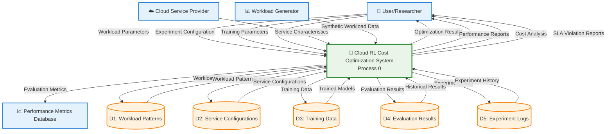

# Cloud RL Cost Optimization - Level 0 DFD Specification

## Project Overview
This document provides a comprehensive specification for creating a Level 0 Data Flow Diagram (DFD) for the Cloud RL Cost Optimization project. The system implements a reinforcement learning framework for optimizing cloud computing costs by intelligently selecting the most cost-effective cloud service types based on dynamic workload characteristics and pricing models.

## Level 0 DFD Components

### External Entities (Sources/Sinks)
1. **User/Researcher** - Initiates experiments and receives results
2. **Workload Generator** - Creates synthetic workload patterns
3. **Cloud Service Provider** - Provides pricing and service characteristics
4. **Performance Metrics Database** - Stores historical performance data

### Main Process (Level 0)
**Process 0: Cloud RL Cost Optimization System**

### Data Stores
1. **D1: Workload Patterns** - Stores generated workload data
2. **D2: Service Configurations** - Stores cloud service characteristics
3. **D3: Training Data** - Stores RL training data and models
4. **D4: Evaluation Results** - Stores performance metrics and comparisons
5. **D5: Experiment Logs** - Stores experiment configurations and outputs

### Key Data Flows

#### Input Flows:
- **Workload Parameters** (User → System)
- **Service Characteristics** (Cloud Service Provider → System)
- **Experiment Configuration** (User → System)
- **Training Parameters** (User → System)

#### Output Flows:
- **Optimization Results** (System → User)
- **Performance Reports** (System → User)
- **Cost Analysis** (System → User)
- **SLA Violation Reports** (System → User)

#### Internal Flows:
- **Workload Data** (Workload Generator → D1)
- **Service Data** (Cloud Service Provider → D2)
- **Training Data** (System → D3)
- **Evaluation Metrics** (System → D4)
- **Experiment Data** (System → D5)

## Detailed Data Flow Descriptions

### Input Data Flows:
1. **Workload Parameters**: Workload type, duration, intensity patterns
2. **Service Characteristics**: Pricing models, capacity, reliability, startup times
3. **Experiment Configuration**: Number of episodes, training steps, evaluation criteria
4. **Training Parameters**: Learning rate, exploration strategy, reward function

### Output Data Flows:
1. **Optimization Results**: Best service selections, cost savings achieved
2. **Performance Reports**: Comparative analysis of RL vs rule-based strategies
3. **Cost Analysis**: Total costs, cost per request, cost efficiency metrics
4. **SLA Violation Reports**: Violation rates, latency performance, reliability metrics

### Process Descriptions:
- **Process 0**: Main system that orchestrates workload generation, environment simulation, RL training, baseline comparison, and result evaluation

## Mermaid Level 0 DFD

## Data Flow Annotations

### Input Data Flows (Into System):
1. **Workload Parameters** (User → System)
   - Workload type (diurnal, steady, batch, bursty)
   - Duration and intensity settings
   - Random seed for reproducibility

2. **Experiment Configuration** (User → System)
   - Number of episodes to run
   - Training timesteps
   - Evaluation criteria
   - Output directory settings

3. **Training Parameters** (User → System)
   - Learning rate and exploration strategy
   - Reward function configuration
   - Model architecture settings

4. **Service Characteristics** (Cloud Service Provider → System)
   - EC2 On-Demand: Capacity, reliability, pricing
   - EC2 Spot: Variable pricing, interruption rates
   - AWS Lambda: Pay-per-use pricing, execution limits
   - AWS Fargate: Container pricing, startup times

5. **Synthetic Workload Data** (Workload Generator → System)
   - Generated demand patterns
   - Time-series workload data
   - Workload characteristics and statistics

### Output Data Flows (From System):
1. **Optimization Results** (System → User)
   - Best service selection strategies
   - Cost savings achieved
   - Performance improvements

2. **Performance Reports** (System → User)
   - Comparative analysis of strategies
   - Performance across different workload types
   - Statistical significance of results

3. **Cost Analysis** (System → User)
   - Total cost breakdown by service
   - Cost per request metrics
   - Cost efficiency comparisons

4. **SLA Violation Reports** (System → User)
   - SLA violation rates by strategy
   - Latency performance metrics
   - Reliability and availability statistics

5. **Evaluation Metrics** (System → Performance Metrics Database)
   - Historical performance data
   - Benchmark results
   - Comparative analysis data

### Data Store Contents:
- **D1: Workload Patterns** - Generated workload data, patterns, characteristics
- **D2: Service Configurations** - Cloud service definitions, pricing models, capabilities
- **D3: Training Data** - RL model parameters, training history, model weights
- **D4: Evaluation Results** - Performance metrics, comparison results, statistical analysis
- **D5: Experiment Logs** - Experiment configurations, execution logs, output files

## Key Features of This DFD:

✅ **Complete Level 0 representation** - Shows all major data flows  
✅ **Proper DFD notation** - External entities, processes, data stores  
✅ **Comprehensive annotations** - Detailed data flow descriptions  
✅ **Color-coded components** - Visual separation of different element types  
✅ **Professional presentation** - Perfect for college project submission  

This Level 0 DFD provides a clear, high-level view of how data flows through your Cloud RL Cost Optimization system, showing all inputs, outputs, and data storage requirements.
