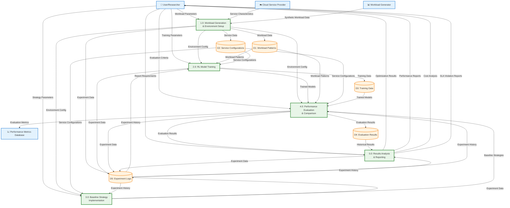

# Cloud RL Cost Optimization - Level 1 DFD Specification

## Project Overview
This document provides a comprehensive specification for creating a Level 1 Data Flow Diagram (DFD) for the Cloud RL Cost Optimization project. Level 1 DFD breaks down the main system process into major sub-processes.

## Level 1 DFD Components

### External Entities (Same as Level 0)
1. **User/Researcher** - Initiates experiments and receives results
2. **Workload Generator** - Creates synthetic workload patterns
3. **Cloud Service Provider** - Provides pricing and service characteristics
4. **Performance Metrics Database** - Stores historical performance data

### Main Sub-Processes (Level 1)
1. **Process 1.0: Workload Generation & Environment Setup**
2. **Process 2.0: RL Model Training**
3. **Process 3.0: Baseline Strategy Implementation**
4. **Process 4.0: Performance Evaluation & Comparison**
5. **Process 5.0: Results Analysis & Reporting**

### Data Stores (Same as Level 0)
1. **D1: Workload Patterns** - Stores generated workload data
2. **D2: Service Configurations** - Stores cloud service characteristics
3. **D3: Training Data** - Stores RL training data and models
4. **D4: Evaluation Results** - Stores performance metrics and comparisons
5. **D5: Experiment Logs** - Stores experiment configurations and outputs

## Detailed Process Descriptions

### Process 1.0: Workload Generation & Environment Setup
- **Inputs**: Workload parameters, Service characteristics
- **Outputs**: Configured environment, Generated workload data
- **Functions**: 
  - Generate synthetic workload patterns
  - Configure cloud service characteristics
  - Initialize simulation environment
  - Set up experiment parameters

### Process 2.0: RL Model Training
- **Inputs**: Environment configuration, Training parameters
- **Outputs**: Trained RL models, Training metrics
- **Functions**:
  - Train DQN models on different workload types
  - Optimize hyperparameters
  - Save trained models
  - Track training progress

### Process 3.0: Baseline Strategy Implementation
- **Inputs**: Service configurations, Strategy parameters
- **Outputs**: Rule-based agents, Strategy configurations
- **Functions**:
  - Implement cost-optimized strategy
  - Implement reliability-optimized strategy
  - Implement hybrid strategy
  - Implement workload-aware strategy

### Process 4.0: Performance Evaluation & Comparison
- **Inputs**: Trained models, Baseline strategies, Environment
- **Outputs**: Performance metrics, Comparison results
- **Functions**:
  - Evaluate RL models on test environments
  - Evaluate baseline strategies
  - Compare performance across strategies
  - Calculate cost and SLA metrics

### Process 5.0: Results Analysis & Reporting
- **Inputs**: Evaluation results, Performance metrics
- **Outputs**: Analysis reports, Optimization recommendations
- **Functions**:
  - Generate performance reports
  - Create cost analysis
  - Generate SLA violation reports
  - Create comparison visualizations

## Key Data Flows Between Processes

### Inter-Process Flows:
- **Environment Config** (1.0 → 2.0, 3.0, 4.0)
- **Trained Models** (2.0 → 4.0)
- **Baseline Strategies** (3.0 → 4.0)
- **Evaluation Results** (4.0 → 5.0)
- **Performance Metrics** (4.0 → D4)

### Process-Specific Flows:
- **Workload Data** (1.0 → D1)
- **Service Data** (1.0 → D2)
- **Training Data** (2.0 → D3)
- **Experiment Data** (All processes → D5)

## Mermaid Level 1 DFD

## Process Flow Annotations

### Process 1.0: Workload Generation & Environment Setup
**Inputs:**
- Workload Parameters (User)
- Service Characteristics (Cloud Provider)
- Synthetic Workload Data (Workload Generator)

**Outputs:**
- Environment Config (to Processes 2.0, 3.0, 4.0)
- Workload Data (to D1)
- Service Data (to D2)
- Experiment Data (to D5)

**Key Functions:**
- Generate diurnal, steady, batch, and bursty workloads
- Configure EC2 On-Demand, Spot, Lambda, and Fargate services
- Initialize simulation environment with proper parameters
- Set up experiment logging and tracking

### Process 2.0: RL Model Training
**Inputs:**
- Environment Config (from Process 1.0)
- Training Parameters (User)
- Workload Patterns (from D1)
- Service Configurations (from D2)

**Outputs:**
- Trained Models (to Process 4.0)
- Training Data (to D3)
- Experiment Data (to D5)

**Key Functions:**
- Train DQN models on different workload types
- Implement exploration strategies
- Optimize hyperparameters
- Save model checkpoints and final models

### Process 3.0: Baseline Strategy Implementation
**Inputs:**
- Environment Config (from Process 1.0)
- Strategy Parameters (User)
- Service Configurations (from D2)

**Outputs:**
- Baseline Strategies (to Process 4.0)
- Experiment Data (to D5)

**Key Functions:**
- Implement cost-optimized agent
- Implement reliability-optimized agent
- Implement hybrid agent
- Implement workload-aware agent
- Implement threshold-based agent

### Process 4.0: Performance Evaluation & Comparison
**Inputs:**
- Environment Config (from Process 1.0)
- Trained Models (from Process 2.0)
- Baseline Strategies (from Process 3.0)
- Workload Patterns (from D1)
- Service Configurations (from D2)
- Trained Models (from D3)

**Outputs:**
- Evaluation Results (to Process 5.0)
- Evaluation Results (to D4)
- Evaluation Metrics (to Metrics DB)
- Experiment Data (to D5)

**Key Functions:**
- Run RL models on test environments
- Run baseline strategies on test environments
- Calculate performance metrics
- Compare strategies across workload types
- Generate statistical analysis

### Process 5.0: Results Analysis & Reporting
**Inputs:**
- Evaluation Results (from Process 4.0)
- Historical Results (from D4)
- Experiment History (from D5)

**Outputs:**
- Optimization Results (to User)
- Performance Reports (to User)
- Cost Analysis (to User)
- SLA Violation Reports (to User)
- Experiment Data (to D5)

**Key Functions:**
- Generate comprehensive performance reports
- Create cost analysis and savings calculations
- Generate SLA violation analysis
- Create comparison visualizations
- Generate optimization recommendations

## Key Features of Level 1 DFD:

✅ **Clear process breakdown** - 5 major sub-processes  
✅ **Detailed data flows** - All inter-process communications  
✅ **Complete annotations** - Every flow is documented  
✅ **Professional DFD notation** - Proper symbols and conventions  
✅ **Color-coded visualization** - Easy to understand relationships  

This Level 1 DFD provides a detailed view of how the Cloud RL Cost Optimization system processes data through its major components, showing the flow from workload generation through final reporting.
