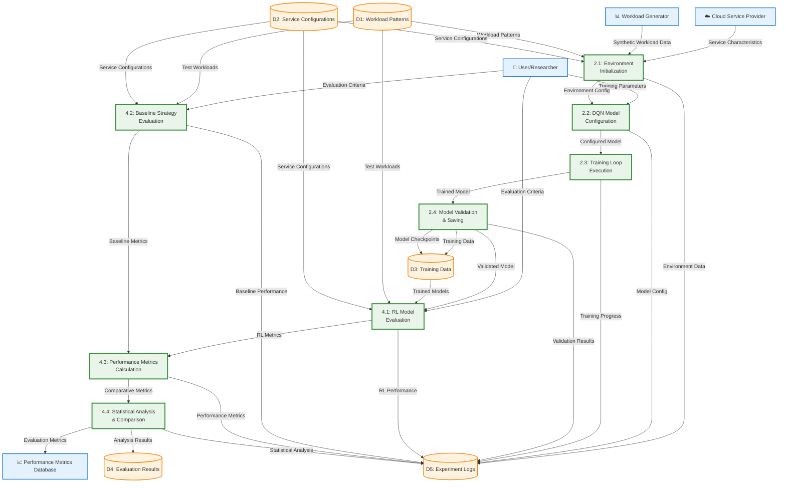

# Cloud RL Cost Optimization - Level 2 DFD Specification

## Project Overview
This document provides a comprehensive specification for creating Level 2 Data Flow Diagrams (DFD) for the Cloud RL Cost Optimization project. Level 2 DFD breaks down the most complex processes (RL Training and Performance Evaluation) into detailed sub-processes.

## Level 2 DFD Components

### External Entities (Same as Level 0 & 1)
1. **User/Researcher** - Initiates experiments and receives results
2. **Workload Generator** - Creates synthetic workload patterns
3. **Cloud Service Provider** - Provides pricing and service characteristics
4. **Performance Metrics Database** - Stores historical performance data

### Detailed Sub-Processes (Level 2)

#### Process 2.0 Breakdown: RL Model Training
- **Process 2.1: Environment Initialization**
- **Process 2.2: DQN Model Configuration**
- **Process 2.3: Training Loop Execution**
- **Process 2.4: Model Validation & Saving**

#### Process 4.0 Breakdown: Performance Evaluation & Comparison
- **Process 4.1: RL Model Evaluation**
- **Process 4.2: Baseline Strategy Evaluation**
- **Process 4.3: Performance Metrics Calculation**
- **Process 4.4: Statistical Analysis & Comparison**

### Data Stores (Same as Level 0 & 1)
1. **D1: Workload Patterns** - Stores generated workload data
2. **D2: Service Configurations** - Stores cloud service characteristics
3. **D3: Training Data** - Stores RL training data and models
4. **D4: Evaluation Results** - Stores performance metrics and comparisons
5. **D5: Experiment Logs** - Stores experiment configurations and outputs

## Detailed Process Descriptions

### Process 2.1: Environment Initialization
- **Inputs**: Workload patterns, Service configurations
- **Outputs**: Initialized environment, Environment parameters
- **Functions**:
  - Load workload data from D1
  - Configure cloud services from D2
  - Initialize simulation environment
  - Set up action and observation spaces

### Process 2.2: DQN Model Configuration
- **Inputs**: Environment parameters, Training parameters
- **Outputs**: Configured DQN model, Model architecture
- **Functions**:
  - Set up neural network architecture
  - Configure hyperparameters
  - Initialize model weights
  - Set up exploration strategy

### Process 2.3: Training Loop Execution
- **Inputs**: Configured model, Environment, Training parameters
- **Outputs**: Training progress, Model updates
- **Functions**:
  - Execute training episodes
  - Update model weights
  - Track training metrics
  - Implement exploration vs exploitation

### Process 2.4: Model Validation & Saving
- **Inputs**: Trained model, Validation data
- **Outputs**: Validated model, Model checkpoints
- **Functions**:
  - Validate model performance
  - Save model checkpoints
  - Generate training reports
  - Store model in D3

### Process 4.1: RL Model Evaluation
- **Inputs**: Trained models, Test environments
- **Outputs**: RL performance metrics
- **Functions**:
  - Load trained models from D3
  - Run models on test environments
  - Calculate performance metrics
  - Track cost and SLA metrics

### Process 4.2: Baseline Strategy Evaluation
- **Inputs**: Baseline strategies, Test environments
- **Outputs**: Baseline performance metrics
- **Functions**:
  - Implement rule-based strategies
  - Run strategies on test environments
  - Calculate baseline metrics
  - Track strategy-specific performance

### Process 4.3: Performance Metrics Calculation
- **Inputs**: RL metrics, Baseline metrics
- **Outputs**: Comparative metrics
- **Functions**:
  - Calculate cost efficiency
  - Calculate SLA violation rates
  - Calculate resource utilization
  - Generate performance summaries

### Process 4.4: Statistical Analysis & Comparison
- **Inputs**: Comparative metrics, Historical data
- **Outputs**: Statistical analysis, Comparison results
- **Functions**:
  - Perform statistical significance tests
  - Generate comparison visualizations
  - Create performance rankings
  - Store results in D4

## Mermaid Level 2 DFD

## Process Flow Annotations

### Process 2.0: RL Model Training Sub-processes

#### Process 2.1: Environment Initialization
**Inputs:**
- Workload Patterns (from D1)
- Service Configurations (from D2)
- Service Characteristics (Cloud Provider)
- Synthetic Workload Data (Workload Generator)

**Outputs:**
- Environment Config (to Process 2.2)
- Environment Data (to D5)

**Key Functions:**
- Load and validate workload data
- Configure cloud service parameters
- Initialize simulation environment
- Set up action and observation spaces

#### Process 2.2: DQN Model Configuration
**Inputs:**
- Environment Config (from Process 2.1)
- Training Parameters (User)

**Outputs:**
- Configured Model (to Process 2.3)
- Model Config (to D5)

**Key Functions:**
- Set up neural network architecture
- Configure hyperparameters (learning rate, buffer size, etc.)
- Initialize model weights
- Set up exploration strategy

#### Process 2.3: Training Loop Execution
**Inputs:**
- Configured Model (from Process 2.2)
- Environment Config (from Process 2.1)

**Outputs:**
- Trained Model (to Process 2.4)
- Training Progress (to D5)

**Key Functions:**
- Execute training episodes
- Update model weights using experience replay
- Track training metrics (loss, reward, etc.)
- Implement epsilon-greedy exploration

#### Process 2.4: Model Validation & Saving
**Inputs:**
- Trained Model (from Process 2.3)
- Validation Data (from environment)

**Outputs:**
- Validated Model (to Process 4.1)
- Training Data (to D3)
- Model Checkpoints (to D3)
- Validation Results (to D5)

**Key Functions:**
- Validate model performance on test data
- Save model checkpoints
- Generate training reports
- Store final model in D3

### Process 4.0: Performance Evaluation Sub-processes

#### Process 4.1: RL Model Evaluation
**Inputs:**
- Trained Models (from D3)
- Test Workloads (from D1)
- Service Configurations (from D2)

**Outputs:**
- RL Metrics (to Process 4.3)
- RL Performance (to D5)

**Key Functions:**
- Load trained models from D3
- Run models on test environments
- Calculate performance metrics
- Track cost and SLA metrics

#### Process 4.2: Baseline Strategy Evaluation
**Inputs:**
- Test Workloads (from D1)
- Service Configurations (from D2)
- Strategy Parameters (User)

**Outputs:**
- Baseline Metrics (to Process 4.3)
- Baseline Performance (to D5)

**Key Functions:**
- Implement rule-based strategies
- Run strategies on test environments
- Calculate baseline metrics
- Track strategy-specific performance

#### Process 4.3: Performance Metrics Calculation
**Inputs:**
- RL Metrics (from Process 4.1)
- Baseline Metrics (from Process 4.2)

**Outputs:**
- Comparative Metrics (to Process 4.4)
- Performance Metrics (to D5)

**Key Functions:**
- Calculate cost efficiency ratios
- Calculate SLA violation rates
- Calculate resource utilization
- Generate performance summaries

#### Process 4.4: Statistical Analysis & Comparison
**Inputs:**
- Comparative Metrics (from Process 4.3)
- Historical Data (from D4)

**Outputs:**
- Analysis Results (to D4)
- Statistical Analysis (to D5)
- Evaluation Metrics (to Metrics DB)

**Key Functions:**
- Perform statistical significance tests
- Generate comparison visualizations
- Create performance rankings
- Store comprehensive results

## Key Features of Level 2 DFD:

✅ **Detailed process breakdown** - 8 sub-processes for complex operations  
✅ **Granular data flows** - Shows internal process communications  
✅ **Complete annotations** - Every sub-process is documented  
✅ **Professional DFD notation** - Proper symbols and conventions  
✅ **Color-coded visualization** - Easy to understand relationships  

This Level 2 DFD provides the most detailed view of the Cloud RL Cost Optimization system's internal processes, showing how complex operations like RL training and performance evaluation are broken down into manageable sub-processes.
